# golfTiles
golfTiles is an open source project aiming to develop a vector tile Schema and Maplibre GL Style Schema to display beautiful maps over golf course facilities. The project will also try to tackle how one could generate your own vector tiles from OpenStreetMap data.


> [!WARNING]
> **This project is in active development.** Schema may be incomplete, or change without notice. 0.1 will have a simple demo with the styled tiles. Discussions are welcome!


## Background
I got interested in OpenStreetMap just because I was in the lookout for tools to create course guides for my local Golf Club. I found the project that is OpenStreetMap during the summer of 2024. I also found that previous work have been done in documenting a tagging schema for golf features in OpenStreetMap during the years: [OpenStreetMap wiki: Tag:leisure=golf_course](https://wiki.openstreetmap.org/wiki/Tag:leisure%3Dgolf_course)

I have though about generating vector tiles for showing of the modern capabilities in golf-apps ever since. I have seen so many golf centric apps which just uses OpenStreetMap Carto, which apart from it being raster tiles, cannot visualize the full breath of golf course mapping in the OSM data. Leveraging modern technology such as vector tiles is the way to go. 

After JW started building the tool [Fairwaymapper](https://www.fairwaymapper.com/map). [Thread on the OpenStreetMap Community Forum about FairwayMapper.](https://community.openstreetmap.org/t/fairwaymapper-introducing-golfers-to-mapping/142814) I starting with gathering feedback and trying to solve the biggest problems in documented tagging of golf course facilities on the OpenStreetMap wiki. The most crucial problem to solve would be how we would represent multiple courses on facilities with 2+ courses. The best proposal we found was using a route=golf relations which would allow one to create vector tiles with data which could be used to animate each hole in one particular course, such as FairwayMappers 3D viewer does. Seeing that the project fairwaymapper went well I got inspired.

## Goals:
The plan is to develop:

- A Vector schema for golf features on zoom 14+.
- A Maplibre GL Style for Maplibre GL JS for zoom 14+ 
- A collection of scripts and instructions how to generate your own golf centric golf tiles for extracts of OpenStreetMap data on features which can be found inside of a (multi)polygons that is leisure=golf_course.
- (Maybe depending on the cost) host the PMtiles on a Cloudflare R2 S3 bucket through the [golftiles.org](https://golftiles.org/) domain. 

My initial plan is to produce PMtiles to avoid having to run a tile server to reduce cost for the initial step. When a style and almost complete vector schema is in place, we can then move on to create a dynamic tile server to serve at least daily updated tiles to encourage mappers.

Many applications could then use these tiles in free and open source golf apps.

It will be interesting to document and estimate how much memory, compute and storage it will take to process all the golf data in the osm database.
---
title: Plan for one-shot generating the PMtiles:
---


```mermaid
flowchart LR
   download(Download one or more extracts of OpenStreetMap data) --> osmium-sort@{shape: docs, label:"Use osmium sort to sort all files inside of data/"} --> osmium-merge@{shape: docs, label:"Use osmium-merge to combine the extracts"} --> tagfilter(Use Osmium tag filter to get all golf courses multipolygons and polygons) --> osmiumGeographicExtract(Run osmium-extract on the original extract, filtering to only cut out the objects inside of the leisure=golf_course polygons from previous step.) --> osmiumRenumber(Use osmium renumber to give the extract dense, sequential IDs so tilemaker can run with --compact.) --> tilemaker(Use the combined osm.obf extract to generate PMTiles using tileMaker with --compact) -. Optionally .-> upload[(Upload the PMTiles using protomaps/go-pmtiles to Cloudflare R2 store or web host supporting CORS)]
click download "https://switch2osm.org/serving-tiles/#System-requirements"
click tagfilter "https://docs.osmcode.org/osmium/latest/osmium-tags-filter.html"
click osmiumGeographicExtract "https://docs.osmcode.org/osmium/latest/osmium-extract.html"
click osmiumRenumber "https://docs.osmcode.org/osmium/latest/osmium-renumber.html"
click osmium-merge "https://docs.osmcode.org/osmium/latest/osmium-merge.html"
click tilemaker "https://github.com/systemed/tilemaker"
click upload "https://docs.protomaps.com/pmtiles/cloud-storage"
```

### Development diary:
See [docs/diary.md](docs/diary.md).


### Requirements
Same as [Tilemaker](https://github.com/systemed/tilemaker#installing) and osmium-tool except it explicit requires Lua 5.3+ for the use of ```math.tointeger(value)```

## How to run the osmium-tool + tilemaker script:

1. Install [Osmium-tool](https://osmcode.org/osmium-tool/). 
2. Tilemaker is added as a submodule to this repository. Run ```git submodule update --init``` to download the submodule. Build tilemaker from source [tilemaker/README.md](tilemaker/README.md). 
3. Download a planet [extract .pbf file(s)](https://switch2osm.org/serving-tiles/#System-requirements) and place it in [data/](data/). 

```cd``` to the root of [golfTiles/](golfTiles/) repository.

Then run:
- run_all.sh 
   - Tilemaker is using [custom-tilemaker/config.json](custom-tilemaker/config.json) and [custom-tilemaker/process.lua](custom-tilemaker/process.lua) as parameters. The script is using the store directory as swapspace, remove it if you have enough RAM. 
- You should now have your ```golfTiles.pmtiles``` file in the root of the project which you can serve with any web server which support [HTTP Range Requests](https://developer.mozilla.org/en-US/docs/Web/HTTP/Guides/Range_requests). You can inspect the PMtiles at https://pmtiles.io/. More information in the Protomaps Docs regarding [Cloud Storage for PMtiles](https://docs.protomaps.com/pmtiles/cloud-storage).

## How to run with Docker (alternative):

If you would rather not install osmium-tool and build tilemaker on your machine, you can run the whole pipeline in a container instead. A ready-made image bundling both tools (built against Lua 5.4, see [Dockerfile](Dockerfile)) is published to the GitHub Container Registry on each release.

1. Download a planet [extract .pbf file(s)](https://switch2osm.org/serving-tiles/#System-requirements) and place it in [data/](data/).
2. From the root of the [golfTiles/](golfTiles/) repository, run:

```
docker run --rm -v "${PWD}:/app" ghcr.io/huggek/golftiles:latest
```

The repository is mounted into the container, so the resulting ```golfTiles.pmtiles``` lands in the root of the project just like the script route above. Works identically with ```podman```. The ```${PWD}``` form works in both bash and PowerShell.

You can also build the image yourself, for example to test changes to the schema:

```
git submodule update --init
docker build -t golftiles .
docker run --rm -v "${PWD}:/app" golftiles
```

## Grants and funding
I registred the domain https://golftiles.org to be able to serve the tiles through the Cloudflare R2 bucket under that domain for the initial PMtiles offering. When we then have something concrete to show grant organisations that this would be something good for the golf community as a whole, we could ask for some money for compute and serve the tiles publicly.

I will try to contact the following in the future:
- The R&A. Asked by email on 2026-06-06. 
- [Allmänna arvsfonden](https://www.arvsfonden.se/). 
- American Golf Industry Coalitions [GRASSROOTS GRANTS PROGRAM](https://www.golfcoalition.org/grassrootsgrants).
- [Lnu Innovation](https://lnu.se/mot-linneuniversitetet/samarbeta-med-oss/lnu-innovation/)

More suggestions welcome!


## Project Structure
```
golfTiles/
├── custom-tilemaker/          
│   ├── config.json            # tilemaker config file, defining source-layers and metadata.
│   └── process.lua            # Process file which decides what should be included in the tiles in what layers and what vector attributes should be written to the features(Schema)
├── data/                      # Folder to place your .pbf extracts to generate tiles on.
│   └── processed/             # Temporary folder used by the run_all.sh script for osmium-tool.
├── docs/                      # Documentation + sources for the GitHub Pages demo site.
│   ├── fonts/                 # Self-hosted glyph .pbf ranges used by the style's glyphs property.
│   ├── samples/               # folder for samples to be downloaded by interested parties and used by the demo.
│   ├── CONTRIBUTING.md        # Contributing information.
│   ├── diary.md               # Some development diary documenting the early process.
│   └── index.html             # The demo page for github pages.
├── openfreemap-styles/        # Git Submodule of openfreemap-styles using the OpenMapTiles schema.
├── store/                     # Folder to be used as swapspace for tilemaker. TBD.
├── styles/                    # Contains the maplibre GL Styles golfTilesStyle.json, 
│   ├── golfTilesStyle.json    # Main golfTilesStyle.json using the golfTiles schema.
│   └── Maputnik.sh            # Script to get maputnik up and running, see instructions in [CONTRIBUTING.md](docs/CONTRIBUTING.md) 
├── tilemaker                  # Git Submodule of tilemaker
├── index.html                 # simple page for the golftiles.org website.
└── run_all.sh                 # Main script to get generate .pmtiles.
```

## Publishing the demo site
The GitHub Pages demo (https://huggek.github.io/golfTiles/) is published by the
[`publish-pages.yml`](.github/workflows/publish-pages.yml) workflow, which runs on every push to
main and on every published release (or manually from the Actions tab). It assembles the site from the canonical sources — the
demo page (`docs/index.html`), the style (`styles/golfTilesStyle.json`, with its pmtiles source URL
rewritten to the Pages origin since golftiles.org serves no CORS headers), the example tilesets
(`docs/samples/`) and the self-hosted font glyphs (`docs/fonts/`) — so no copies need to be kept in
sync by hand. Longer term, golftiles.org is meant to be the bucket endpoint serving the tiles and
the style, with the GitHub Pages site acting as the demo page.

## Future technical development to solve the limitation using tileMaker
In the future one could maybe use a "dynamic" tile generator server such as:
- osm2psql 
- imposm3 
- Martin. 
To be able to do incremental updates, but this would be more complex and require server infrastructure. https://github.com/HuggeK/golfTiles/issues/21 Thats where grants comes into the picture.

- Other future endeavors could also be to explore the new [MapLibre Tile (MLT)](https://github.com/maplibre/maplibre-tile-spec) to encode the DEM data from [Mapterhorn](https://mapterhorn.com/) directly into the tiles. https://github.com/HuggeK/golfTiles/issues/25

## Contributing
I would advise to wait until a first 0.1 release has been released until beginning to help on the schema and style itself, due to the schema can rapidly change before a style has been developed. See [CONTRIBUTING.md](docs/CONTRIBUTING.md) for guidelines.

Especial help wanted on the following areas:
- [ ] Improving the Maplibre GL style. 
- [ ] Write a basic course viewer using some web framework together with Maplibre GL JS as a demo, only consuming data from the tiles themselves. Especially interesting would be to be able to chose as particular course and animate through each hole. https://github.com/HuggeK/golfTiles/issues/20
- [ ] Use a dynamic tile server instead of tilemaker. https://github.com/HuggeK/golfTiles/issues/21

You can also check the issues on github with the labels: [Help wanted](https://github.com/HuggeK/golfTiles/issues?q=state%3Aopen%20label%3A%22help%20wanted%22), [OSM wiki Improvements](https://github.com/HuggeK/golfTiles/issues?q=state%3Aopen%20label%3A%22OSM%20wiki%20improvements%22) and [good first issue](https://github.com/HuggeK/golfTiles/issues?q=state%3Aopen%20label%3A%22good%20first%20issue%22).


## Attribution:
Using the code and style should be attributed to golfTiles. Tiles generated by the schema is attributed to "Schema and style [golftiles.org](https://golftiles.org/)" or "Schema and style [golfTiles](https://github.com/HuggeK/golfTiles)" + "OpenStreetMap contributors". Remember to link to [openstreetmap.org/copyright](https://openstreetmap.org/copyright). Note that the ODbL still apply for OpenStreetMap data, always give the proper attribution where you display the tiles.

# License:
The script to run the commands, process.lua and style is licensed under [GPL-3.0 license](LICENSE). Note that the GPL allows you to use it on your own server(SaaS or ASP loophole) and then generate tiles to use in your commercial application. Full licenSe in [LICENSE](LICENSE). 

### Generated PMtiles:
Generated PMtiles is licensed under the ODbL and [CC BY](https://creativecommons.org/licenses/by/4.0/deed.en) for attribution to the golfTiles project.