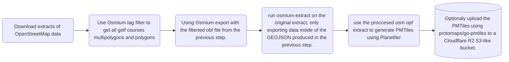

# Background
I got intrested in OpenStreetMap just becuase I was in the lookout for tools to create course guides for my local Golf Club. I found the project that is OpenStreetMap during the summer of and after that got intrested in all things that is those "new" crisp vector maps. 
I also found that previous work have been done in documenting a tagging schema for golf features in OpenStreetMap during the years: https://wiki.openstreetmap.org/wiki/Tag:leisure%3Dgolf_course 
During the development and feedback on the Tool Fairwaymapper - https://community.openstreetmap.org/t/fairwaymapper-introducing-golfers-to-mapping/142814 I updated the tagging schema to allow to represent multiple courses on a golf course facility with route=golf relations.

Seeing that the project fairwaymapper went well I got inspired to actually create a vector layor schema for golf features and export vector tiles of only all features inside of all (multi)polygons that is leisure=golf_course around the world.
Many applications could then use these tiles in free and open source golf apps.

It will be intresting to document and estimate how much memory, compute and storage it will take to procces all the golf data in the osm database.

# Plan:
My plan is to devlop a Vector schema/style and a collection of tools and instructions how to generate your own golf centric golf tiles. 

Maybe if the cost is not to big I would then also host the PMtiles on Cloudflare R2 S3 bucket through my hugge.se domain. 

My plan is to produce PMtiles to avoid having to run a tile server to reduce cost. 

# Previous questions on forums:

- Question about to be able to fallback to general purpose tileset for orientation to the golf courses on OSM US Slack: https://osmus.slack.com/archives/C03TFH5NE83/p1779814786461319 Using one for an basemap and one for an overlay.
- Good feedback from the #developer channel in the OpenStreetMap Discord on how to make the export and filtering: [link](https://discord.com/channels/413070382636072960/607265062322700308/1508868644770283601)

# Possible limitations cut down extract using Osmium 
The workflow using the Martin tilegenerator would may be more efficient with a full Postgress SQL database to be able to get incrimental updates, this may be future development. My initial goal is to estimate the size of the final PMtiles. 

Other future endeavours could also be to explore the new [MapLibre Tile (MLT)](https://github.com/maplibre/maplibre-tile-spec) to encode the DEM data from [Mapterhorn](https://mapterhorn.com/) directly into the tile. 

# Help wanted!
If you know something about tile generation or nothing at all, this project will be Open Source, so anyone is welcome to contribute to it!

---
title: Plan for generating the PMtiles
---

