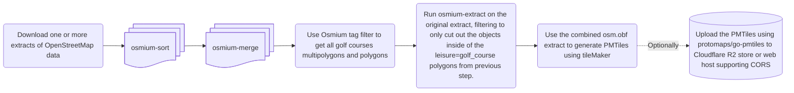

# Background
I got interested in OpenStreetMap just because I was in the lookout for tools to create course guides for my local Golf Club. I found the project that is OpenStreetMap during the summer of 2024. I also found that previous work have been done in documenting a tagging schema for golf features in OpenStreetMap during the years: [OpenStreetMap wiki: Tag:leisure=golf_course](https://wiki.openstreetmap.org/wiki/Tag:leisure%3Dgolf_course)

I have though about generating vector tiles for showing of the modern capabilities in golf-apps ever since. I have seen so many golf centric apps which just uses OpenStreetMap Carto, which is not optimal in 2026. Leveraging modern technology such as vector tiles is the way to go. After JW started building the tool [Fairwaymapper](https://www.fairwaymapper.com/map). [Thread on the OpenStreetMap Community Forum about FairwayMapper.](https://community.openstreetmap.org/t/fairwaymapper-introducing-golfers-to-mapping/142814) I starting with gathering feedback and trying to solve the biggest problems in documented tagging of golf course facilities on the OpenStreetMap wiki. The most crucial problem to solve would be how we would represent multiple courses on facilities with 2+ courses. The best proposal we found was using a route=golf relations which would allow one to create vector tiles with data which could be used to animate each hole in one particular course, such as FairwayMappers 3D viewer does. Seeing that the project fairwaymapper went well I got inspired.

Many applications could then use these tiles in free and open source golf apps.

It will be interesting to document and estimate how much memory, compute and storage it will take to process all the golf data in the osm database.

# Plan:
My plan is to develop:

- Simple Vector schema for golf features on zoom 14+ 
- Process scripts for features which can be found inside of a (multi)polygons that is leisure=golf_course.
- A Maplibre GL Style for Maplibre GL JS. 
- A collection of tools and instructions how to generate your own golf centric golf tiles. 
- (Maybe depending on the cost) host the PMtiles on a Cloudflare R2 S3 bucket through the [golftiles.org](https://golftiles.org/) domain. 

My initial plan is to produce PMtiles to avoid having to run a tile server to reduce cost for the initial step. When a style and almost complete vector schema is in place, we can then move on to create a dynamic tile server to serve at least daily updated tiles to encourage mappers.

# Previous discussion and questions on forums:
- Question about to be able to fallback to general purpose tileset for orientation to the golf courses on OSM US Slack: https://osmus.slack.com/archives/C03TFH5NE83/p1779814786461319 Using one for basemap and our golfTiles for overlay.
- Good feedback from the #developer channel in the OpenStreetMap Discord on how to make the export and filtering: [link](https://discord.com/channels/413070382636072960/607265062322700308/1508868644770283601)
- Tips from utidjinn, having a similar goal on the [OSM US slack #golf channel](https://osmus.slack.com/archives/CU8J8335X/p1780070298248989?thread_ts=1779912821.021149&cid=CU8J8335X)


---
title: Plan for one-shot generating the PMtiles:
---


## Development diary:
I created a tag filter with the ways and relations with the leisure=golf_course, using the geojson did not work in using it with the extract command, but my fast look at the geojsons it looks like it can detect it so that was a good sanity-check that the tag-filter was succesfull when opening it in QGIS. So I did not use the export to geojson, but just used the two files. I was able to generate some PMtiles using the default OpenMapTiles schema which is included in the tileMaker repository. I then used the extract command with the tag filtered pbf file which was 618 kb. I first used the smart strategy, but that looks like it includes way to much data outside of the facilities. I then switched back to the complete_ways strategy and on the complete sweden export it took: 
```[ 0:09] Peak memory used: 4713 MBytes``` when running the Osmium-tool inside of WSL 2 on a Ubuntu 26.04 OS. The resulting file pbf was: ```6 279kb``` for Sweden. See the shell scripts in the repo.

- [X] Wrote the .json for configuring the layers for tileMaker. My initial though is to put all golf features into one layer with no cut-offs for zoom. When viewing a golf course you are viewing the course at zoom level 14+ anyways.
- [X] Figure out how to encode the two different tagging practices of tagging course(s) in a facility into the tiles. Using the ```route=golf```
- [X] Write the basics of ```process.lua``` for tileMaker. Trying to gather as much features as I can think of. This can then be used when we adapt the code in the future for a dynamic tile server.
- [X] Try to generate some samples.
- [X] Put up some demo PMtiles on [golftiles.org](https://golftiles.org/)


I configured my WSL2 ubuntu 26.04 VM with 23 GiB of RAM and 7.8 GiB of ssd swapspace. When trying to run the entire europe-latest.osm.pbf my VM crashes. More investigation is needed, maybe use more swapspace.

It would have been good if I could write metadata when the tiles was generated and what extracts it is based upon on as metadata, I opened an [idea](https://github.com/systemed/tilemaker/discussions/911) in the discussion page of the tilemaker repository. It would be good if it could be fetched from the metadata of the .pbf files osmium has processed. It seems like the osmium-tool steps is removing the metadata. Seems like there was a [pull request](https://github.com/osmcode/libosmium/issues/241) which was merged, which adds this to libosmium. 


<details>
<summary>Test with data/united-kingdom-260602.osm.pbf: </summary>

```bash
Processing: data/united-kingdom-260602.osm.pbf
[ 0:00] Started osmium sort
[ 0:00]   osmium version 1.19.0
[ 0:00]   libosmium version 2.23.0
[ 0:00] Command line options and default settings:
[ 0:00]   input options:
[ 0:00]     file names:
[ 0:00]       data/united-kingdom-260602.osm.pbf
[ 0:00]     file format:
[ 0:00]   output options:
[ 0:00]     file name: data/processed/sorted.united-kingdom-260602.osm.pbf
[ 0:00]     file format:
[ 0:00]     generator: osmium/1.19.0
[ 0:00]     overwrite: no
[ 0:00]     fsync: no
[ 0:00]   other options:
[ 0:00]     strategy: multipass
[ 0:00] Reading input file headers...
[ 0:00] Opening output file...
[ 0:00] Pass 1...
[ 0:00] Reading contents of input files...
[ 0:06] Number of buffers: 230081
[ 0:06] Sum of buffer sizes: 14058355728 (13.407 GB)
[ 0:06] Sum of buffer capacities: 15078588416 (14.38 GB, 93% full)
[ 0:06] Sorting data...
[ 0:18] Writing out sorted data...
[ 0:27] Pass 2...
[ 0:27] Reading contents of input files...
[ 0:31] Number of buffers: 144490
[ 0:31] Sum of buffer sizes: 9277072112 (8.847 GB)
[ 0:31] Sum of buffer capacities: 9469296640 (9.03 GB, 98% full)
[ 0:31] Sorting data...
[ 0:37] Writing out sorted data...
[ 0:49] Pass 3...
[ 0:49] Reading contents of input files...
[ 0:51] Number of buffers: 2413
[ 0:51] Sum of buffer sizes: 186613144 (0.177 GB)
[ 0:51] Sum of buffer capacities: 195493888 (0.186 GB, 95% full)
[ 0:51] Sorting data...
[ 0:51] Writing out sorted data...
[======================================================================] 100%
[ 0:51] Closing output file...
[ 0:51] Peak memory used: 17776 MBytes
[ 0:51] Done.
[======================================================================] 100%
[ 0:00] Started osmium tags-filter
[ 0:00]   osmium version 1.19.0
[ 0:00]   libosmium version 2.23.0
[ 0:00] Command line options and default settings:
[ 0:00]   input options:
[ 0:00]     file name: data/processed/merged.osm.pbf
[ 0:00]     file format:
[ 0:00]   output options:
[ 0:00]     file name: data/processed/golfcourses.mask.osm.pbf
[ 0:00]     file format:
[ 0:00]     generator: osmium/1.19.0
[ 0:00]     overwrite: no
[ 0:00]     fsync: no
[ 0:00]   other options:
[ 0:00]     add referenced objects: yes
[ 0:00]     invert match: no
[ 0:00]     remove tags on non-matching objects: no
[ 0:00]   looking for tags...
[ 0:00]     on nodes: no
[ 0:00]     on ways: yes
[ 0:00]     on relations: yes
[ 0:00] Opening output file...
[ 0:00] Following references...
[ 0:00]   Reading input file to find relations in relations...
[ 0:02]   Reading input file to find nodes/ways in relations...
[ 0:04]   Reading input file to find nodes in ways...
[ 0:09] Done following references.
[ 0:09] Opening input file...
[ 0:09] Copying matching objects to output file...
[======================================================================] 100%
[ 0:14] Closing output file...
[ 0:14] Closing input file...
[ 0:14] Peak memory used: 3063 MBytes
[ 0:14] Needed 4 pass(es) through the input file.
[ 0:14] Done.
Output file exists, will overwrite (Ctrl-C to abort)
Layer facilities (z0-14)
Layer golf (z12-14)
Layer other (z12-14)
Bounding box -7.90039, 49.925, 1.74117, 60.3848
Generated points: 0, lines: 0, polygons: 0
Reading .pbf data/processed/extract.osm.pbf
(Scanning for ways used in relations: 50%)           (93 ms)
(Scanning for nodes used in ways: 97%)           (269 ms)
Block 1756/1757 (532 ms)
SortedNodeStore: 0 groups, 0 chunks, 0 nodes, 0 bytes (0% wasted)
SortedNodeStore: 0 groups, 0 chunks, 0 nodes, 0 bytes (0% wasted)
SortedNodeStore: 121569 groups, 433682 chunks, 7826272 nodes, 62474500 bytes (37.9% wasted)
SortedNodeStore: 59 groups, 141 chunks, 3880 nodes, 28394 bytes (99.8% wasted)
SortedNodeStore: 74478 groups, 194100 chunks, 3054953 nodes, 26683128 bytes (62.5% wasted)
SortedNodeStore: 0 groups, 0 chunks, 0 nodes, 0 bytes (0% wasted)
3/6 Block 8/82 Invalid integer: hole_number=7 & 16|way 240311739
Invalid integer: hole_number=8 & 17|way 240311740
Invalid integer: hole_number=6 & 15|way 240311741
Invalid integer: hole_number=5 & 14|way 240311742
Invalid integer: hole_number=9 & 18|way 240311748
3/6 Block 14/82 Invalid integer: dist=129 Yds|way 60963639
Invalid integer: dist=488 Yds|way 61163332
3/6 Block 32/82 Invalid integer: par=4/5|way 829978497
3/6 Block 33/82 Invalid integer: par=4/5|way 830291158
Invalid integer: par=4/5|way 830297742
Invalid integer: par=4/5|way 830680529
Invalid integer: hole_number=TF - 17|way 774721268
Invalid integer: hole_number=TF - 18|way 774721269
Invalid integer: hole_number=TF - 1|way 774721274
3/6 Block 35/82 Invalid integer: handicap=y|way 790983714
3/6 Block 37/82 Invalid integer: par=5/4|way 827491775
Invalid integer: par=4/3|way 827491776
3/6 Block 38/82 Invalid integer: hole_number=1/10|way 827729323
Invalid integer: hole_number=2/11|way 827729325
Invalid integer: hole_number=4/13|way 827729329
Invalid integer: hole_number=5/14|way 827729330
Invalid integer: hole_number=6/15|way 827729331
Invalid integer: hole_number=7/16|way 827729332
Invalid integer: hole_number=8/17|way 827729333
Invalid integer: hole_number=9/18|way 827729334
3/6 Block 47/82 Invalid integer: hole_number=S|way 1062253185
Invalid integer: hole_number=S|way 1062259247
Invalid integer: hole_number=S|way 1062265967
Invalid integer: hole_number=S|way 1062265978
Invalid integer: dist=333 yards|way 948441117
3/6 Block 49/82 Invalid integer: hole_number=10a|way 1101066309
Invalid integer: handicap=10 / 3|way 1138543171
Invalid integer: hole_number=5/14|way 1138543171
Invalid integer: hole_number=9/18|way 1138543173
Invalid integer: handicap=18 / 13|way 1138543174
Invalid integer: hole_number=1/10|way 1138543174
Invalid integer: handicap=8 / 5|way 1138543175
Invalid integer: hole_number=2/11|way 1138543175
Invalid integer: handicap=16 / 17|way 1138543181
Invalid integer: hole_number=3/12|way 1138543181
Invalid integer: handicap=6 / 7|way 1138543189
Invalid integer: hole_number=4/13|way 1138543189
Invalid integer: handicap=2 / 1|way 1138543195
Invalid integer: hole_number=6/15|way 1138543195
Invalid integer: handicap=12 / 11|way 1138543199
Invalid integer: hole_number=7/16|way 1138543199
Invalid integer: handicap=4 / 9|way 1138543203
Invalid integer: hole_number=8/17|way 1138543203
3/6 Block 50/82 Invalid integer: handicap=e|way 1059197172
3/6 Block 51/82 Invalid integer: hole_number=Becton 2|way 955328046
Invalid integer: hole_number=Becton 1|way 955328047
Invalid integer: hole_number=Becton 3|way 955328048
Invalid integer: hole_number=Becton 4|way 955328049
Invalid integer: hole_number=Becton 5|way 955328050
Invalid integer: hole_number=Becton 6|way 955328051
Invalid integer: hole_number=Becton 7|way 955328052
Invalid integer: hole_number=Becton 8|way 955328053
Invalid integer: hole_number=Becton 9|way 955328054
Invalid integer: hole_number=Needles 1|way 955331115
Invalid integer: handicap=11 / 12|way 1150790400
Invalid integer: hole_number=2/11|way 1150790400
Invalid integer: handicap=9 / 10|way 1150790401
Invalid integer: hole_number=1/10|way 1150790401
Invalid integer: hole_number=Needles 2|way 955331117
Invalid integer: handicap=3 / 4|way 1150790404
Invalid integer: hole_number=3/12|way 1150790404
Invalid integer: handicap=15 / 16|way 1150790408
Invalid integer: hole_number=4/13|way 1150790408
Invalid integer: hole_number=Needles 3|way 955331119
Invalid integer: hole_number=Needles 4|way 955331120
Invalid integer: handicap=5 / 6|way 1150790412
Invalid integer: hole_number=5/14|way 1150790412
Invalid integer: hole_number=Needles 5|way 955331121
Invalid integer: handicap=2 / 1|way 1150790414
Invalid integer: hole_number=6/15|way 1150790414
Invalid integer: hole_number=Needles 6|way 955331122
Invalid integer: hole_number=Needles 7|way 955331123
Invalid integer: hole_number=Needles 8|way 955331124
Invalid integer: hole_number=Needles 9|way 955331125
Invalid integer: handicap=17 / 18|way 1150790418
Invalid integer: hole_number=7/16|way 1150790418
Invalid integer: handicap=7 / 8|way 1150790424
Invalid integer: hole_number=8/17|way 1150790424
Invalid integer: handicap=13 / 14|way 1150790427
Invalid integer: hole_number=9/18|way 1150790427
Invalid integer: hole_number=Stroller 9|way 955334880
3/6 Block 57/82 Invalid integer: hole_number=3 / 12|way 1313852692
Invalid integer: hole_number=5 / 14|way 1313852708
Invalid integer: hole_number=6 / 15|way 1313852709
3/6 Block 58/82 Invalid integer: handicap=e|way 1092817080
3/6 Block 60/82 Invalid integer: dist=160 yards|way 1095597334
Invalid integer: dist=347 yards|way 1095597336
Invalid integer: dist=283 yards|way 1095597337
Invalid integer: dist=367 yards|way 1095597339
Invalid integer: dist=338 yards|way 1095703215
Invalid integer: dist=162 yards|way 1095703216
Invalid integer: dist=247 yards|way 1095703217
Invalid integer: dist=163 yards|way 1095703218
Invalid integer: dist=392 yards|way 1095703219
Invalid integer: dist=457 yards|way 1095703220
3/6 Block 61/82 Invalid integer: hole_number=(1)|way 1377146264
Invalid integer: hole_number=(2)|way 1377146265
Invalid integer: hole_number=(3)|way 1377146266
Invalid integer: hole_number=(4)|way 1377146267
Invalid integer: hole_number=(5)|way 1377146268
Invalid integer: hole_number=(6)|way 1377146269
Invalid integer: hole_number=(7)|way 1377146270
Invalid integer: hole_number=(8)|way 1377146271
Invalid integer: hole_number=(9)|way 1377146272
3/6 Block 62/82 Invalid integer: hole_number=6 & 15|way 1377496225
Invalid integer: hole_number=5 & 14|way 1377496226
Invalid integer: hole_number=(OC) - 1|way 1178584175
Invalid integer: hole_number=1 & 10|way 1377496229
Invalid integer: hole_number=2 & 11|way 1377498729
Invalid integer: hole_number=2fg|way 1361703054
Invalid integer: hole_number=3 & 12|way 1377503073
Invalid integer: hole_number=9 & 18|way 1377507444
Invalid integer: hole_number=4 & 13|way 1377532060
Invalid integer: hole_number=7 & 16|way 1377575439
Invalid integer: hole_number=(OC) - 2|way 1178645182
Invalid integer: hole_number=8 & 17|way 1377575443
Invalid integer: hole_number=1 & 10|way 1377610950
Invalid integer: hole_number=2 & 11|way 1377610954
Invalid integer: hole_number=3 & 12|way 1377610959
Invalid integer: hole_number=4 & 13|way 1377613116
Invalid integer: hole_number=(OC) - 3|way 1179792532
Invalid integer: hole_number=(OC) - 4|way 1179794850
Invalid integer: hole_number=(OC) - 5|way 1180051590
Invalid integer: hole_number=(NC) - 1|way 1377861351
Invalid integer: hole_number=(NC) - 18|way 1377861352
Invalid integer: hole_number=(NC) - 2|way 1377861353
Invalid integer: hole_number=(NC) - 3|way 1377861355
Invalid integer: hole_number=(NC) - 4|way 1377861356
Invalid integer: hole_number=(NC) - 5|way 1377861357
Invalid integer: hole_number=(NC) - 6|way 1377861358
Invalid integer: hole_number=(NC) - 7|way 1377861359
Invalid integer: hole_number=(NC) - 8|way 1377861360
Invalid integer: hole_number=(NC) - 9|way 1377861361
Invalid integer: hole_number=(NC) - 10|way 1377861362
Invalid integer: hole_number=(NC) - 11|way 1377861363
Invalid integer: hole_number=(NC) - 12|way 1377861364
Invalid integer: hole_number=(NC) - 13|way 1377861365
Invalid integer: hole_number=(NC) - 14|way 1377861366
Invalid integer: hole_number=(NC) - 15|way 1377861367
Invalid integer: hole_number=(NC) - 16|way 1377861368
Invalid integer: hole_number=(NC) - 17|way 1377861369
Invalid integer: hole_number=(OC) - 6|way 1180052892
Invalid integer: hole_number=(OC) - 7|way 1180055864
Invalid integer: hole_number=(OC) - 8|way 1180058834
Invalid integer: hole_number=(OC) - 9|way 1180483026
Invalid integer: hole_number=(OC) - 10|way 1180484639
Invalid integer: hole_number=(OC) - 11|way 1180487834
Invalid integer: hole_number=(OC) - 12|way 1180489240
Invalid integer: hole_number=(OC) - 13|way 1180492272
Invalid integer: hole_number=(OC) - 14|way 1180507507
Invalid integer: hole_number=(OC) - 15|way 1180508332
Invalid integer: hole_number=(OC) - 16|way 1180510667
Invalid integer: hole_number=(OC) - 17|way 1180599101
Invalid integer: hole_number=(OC) - 18|way 1180601064
3/6 Block 63/82 Invalid integer: hole_number=1fg|way 1320959674
Invalid integer: hole_number=3fg|way 1320959678
Invalid integer: hole_number=4fg|way 1320959680
Invalid integer: hole_number=5fg|way 1320959682
Invalid integer: hole_number=6fg|way 1320959684
Invalid integer: hole_number=7fg|way 1320959686
Invalid integer: hole_number=8fg|way 1320959688
Invalid integer: hole_number=9fg|way 1320959690
Invalid integer: hole_number=8, 17|way 1380188290
Invalid integer: hole_number=1, 10|way 1380188297
Invalid integer: hole_number=3, 12|way 1380188303
Invalid integer: hole_number=4, 13|way 1380188305
Invalid integer: hole_number=5, 14|way 1380188307
Invalid integer: hole_number=1 / 10|way 1308516457
Invalid integer: hole_number=2 / 11|way 1308516464
Invalid integer: hole_number=3 / 12|way 1308516471
Invalid integer: hole_number=4 / 13|way 1308516476
Invalid integer: hole_number=5 / 14|way 1308516478
Invalid integer: hole_number=6 / 15|way 1308516479
Invalid integer: hole_number=7 / 16|way 1308516481
Invalid integer: hole_number=8 / 17|way 1308516483
Invalid integer: hole_number=9 / 18|way 1308516485
Invalid integer: dist=332 yd|way 1421111928
Invalid integer: dist=403 yd|way 1421111931
Invalid integer: dist=447 yd|way 1421111938
Invalid integer: dist=531 yd|way 1421111946
Invalid integer: dist=271 yd|way 1421111949
Invalid integer: dist=407 yd|way 1421203276
Invalid integer: dist=158 yd|way 1421203279
Invalid integer: dist=506 yd|way 1421203285
Invalid integer: dist=447 yd|way 1421203293
Invalid integer: dist=354 yd|way 1421203296
Invalid integer: dist=338 yd|way 1421203300
Invalid integer: dist=380 yd|way 1421203304
Invalid integer: dist=180 yd|way 1421203315
Invalid integer: dist=358 yd|way 1421203323
Invalid integer: dist=420 yd|way 1421203336
Invalid integer: dist=386 yd|way 1421203346
Invalid integer: dist=175 yd|way 1421203351
Invalid integer: dist=448 yd|way 1421203354
Invalid integer: hole_number=1o|way 1395467099
Invalid integer: hole_number=3, 15|way 1395997369
Invalid integer: hole_number=1, 13|way 1395997370
Invalid integer: hole_number=1/10|way 1345784958
Invalid integer: hole_number=2/11|way 1345784963
Invalid integer: hole_number=3/12|way 1345784971
Invalid integer: hole_number=4/13|way 1345784973
Invalid integer: hole_number=5/14|way 1345784978
Invalid integer: hole_number=6/15|way 1345784981
Invalid integer: hole_number=7/16|way 1345784986
Invalid integer: hole_number=8/17|way 1345784988
3/6 Block 64/82 Invalid integer: hole_number=1 / 13|way 1381737817
Invalid integer: hole_number=2 / 14|way 1381737819
Invalid integer: hole_number=3 / 15|way 1381737821
Invalid integer: hole_number=4 / 16|way 1381737823
Invalid integer: hole_number=5 / 17|way 1381737825
Invalid integer: hole_number=1 & 10|way 1382012212
3/6 Block 65/82 Invalid integer: hole_number=2/7|way 1436978589
3/6 Block 66/82 Invalid integer: hole_number=1golf|way 1367297684
Invalid integer: hole_number=2golf|way 1367297685
Invalid integer: hole_number=3golf|way 1367297686
Invalid integer: hole_number=4golf|way 1367297687
Invalid integer: hole_number=6golfgolf|way 1367297688
Invalid integer: hole_number=7golf|way 1367297689
Invalid integer: hole_number=8golf|way 1367297690
Invalid integer: hole_number=9golf|way 1367297691
Invalid integer: hole_number=TF - 16|way 1486295131
Invalid integer: hole_number=TF - 2|way 1486295132
Invalid integer: hole_number=TF - 3|way 1486295134
Invalid integer: hole_number=TF - 6|way 1486295135
Invalid integer: hole_number=TF - 5|way 1486295136
Invalid integer: hole_number=TF - 4|way 1486295137
Invalid integer: hole_number=TF - 7|way 1486301886
Invalid integer: hole_number=TF - 11|way 1486301887
Invalid integer: hole_number=TF - 10|way 1486301890
Invalid integer: hole_number=TF - 8|way 1486301893
Invalid integer: hole_number=TF - 9|way 1486302445
Invalid integer: hole_number=TF - 14|way 1486302448
Invalid integer: hole_number=TF - 15|way 1486302637
Invalid integer: hole_number=TF - 12|way 1486304612
Invalid integer: hole_number=TF - 13|way 1486304613
Invalid integer: hole_number=2, 11|way 1368473838
Invalid integer: hole_number=3, 12|way 1368477382
Invalid integer: hole_number=6, 15|way 1368488097
Invalid integer: hole_number=8, 17|way 1368490089
Invalid integer: hole_number=9, 18|way 1368491117
3/6 Block 71/82 Invalid integer: par=.|way 1372428235
Invalid integer: hole_number=1 'Colliery Way'|way 1373478330
Invalid integer: hole_number=2 'Woodlands'|way 1373478333
Invalid integer: hole_number=3 'The Priory'|way 1373478336
Invalid integer: hole_number=4 'The Spinney'|way 1373478339
Invalid integer: hole_number=5 'Silver Birches'|way 1373478342
Invalid integer: hole_number=6 'The Pulpit'|way 1373478345
Invalid integer: hole_number=7 'The Warren'|way 1373478348
Invalid integer: hole_number=8 'The Butts'|way 1373478351
Invalid integer: hole_number=9 'Daffodills'|way 1373478354
Invalid integer: hole_number=10 'Corseeit'|way 1373478357
Invalid integer: hole_number=11 'The Farm'|way 1373478360
Invalid integer: hole_number=12 'The Drop'|way 1373478363
Invalid integer: hole_number=13 'Wheerisit'|way 1373478366
Invalid integer: hole_number=14 'Grave Outlook'|way 1373478369
Invalid integer: hole_number=15 'Badger's Walk'|way 1373478372
Invalid integer: hole_number=16 'Peter's Folly'|way 1373478375
Invalid integer: hole_number=17 'The Valley'|way 1373478378
Invalid integer: hole_number=18 'Gooin Wum'|way 1373478381
Invalid integer: hole_number=11a (Summer)|way 1312804945
Invalid integer: hole_number=11a (Summer)|way 1312804946
Invalid integer: hole_number=12a (Summer)|way 1312811108
Invalid integer: hole_number=11b (Winter)|way 1312811109
Invalid integer: hole_number=12b (Winter)|way 1312811114
3/6 Block 73/82 Invalid integer: hole_number=15 Sand Crescent|way 1385558635
3/6 Block 75/82 Invalid integer: par=5/4|way 1479637307
Invalid integer: par=3/4|way 1479637308
3/6 Block 81/82 (461 ms)
(226 ms)
Invalid integer: par=4;5|way 356856535
Invalid integer: par=4;5|way 356864048
Invalid integer: handicap=white=7|way 498960312
Invalid integer: handicap=white=5|way 499153283
Invalid integer: dist=499 yards|way 989332862
Invalid integer: dist=167 yards|way 989332863
Invalid integer: dist=427 yards|way 989332864
Invalid integer: dist=320 yards|way 989332865
Invalid integer: dist=377yards|way 989332866
Invalid integer: dist=402 yards|way 989332867
Invalid integer: dist=340 yards|way 989332868
Invalid integer: dist=217 yards|way 989332869
Invalid integer: dist=495 yards|way 989332870
Invalid integer: dist=453 yards|way 989343989
Invalid integer: dist=362 yards|way 989343990
Invalid integer: dist=503 yards|way 989343991
Invalid integer: dist=414 yards|way 989343992
Invalid integer: dist=447 yards|way 989343993
Invalid integer: dist=170 yards|way 989343994
Invalid integer: dist=302 yards|way 989343995
Invalid integer: dist=164 yards|way 989343996
Invalid integer: dist=534 yards|way 989343997
Invalid integer: dist=157 yards|way 980173580
Invalid integer: dist=474 yards|way 980512872
Invalid integer: dist=166 yards|way 980512885
Invalid integer: dist=470 yards|way 980512914
Invalid integer: dist=433 yards|way 980559663
Invalid integer: dist=145 yards|way 980559675
Invalid integer: dist=145 yards|way 980559676
Invalid integer: dist=563 yards|way 980559689
Invalid integer: dist=563 yards|way 980559691
Invalid integer: dist=191 yards|way 980559705
Invalid integer: dist=191 yards|way 980559706
Invalid integer: dist=421 yards|way 980559718
Invalid integer: dist=246 yards|way 980559732
Invalid integer: dist=448 yards|way 980559744
Invalid integer: dist=179 yards|way 980605975
Invalid integer: dist=179 yards|way 980605976
Invalid integer: dist=347 yards|way 980605987
Invalid integer: hole_number=1o|way 1050279848
Invalid integer: dist=200 yards|way 980606011
Invalid integer: dist=319 yards|way 980606012
Invalid integer: dist=515 yards|way 980606021
Invalid integer: dist=423 yards|way 980606029
Invalid integer: dist=191 yards|way 1080848744
Invalid integer: hole_number=2,11|way 1145111226
Invalid integer: hole_number=9,18|way 1145111229
Invalid integer: hole_number=8,17|way 1145111232
Invalid integer: hole_number=4,13|way 1145111233
Invalid integer: hole_number=5,14|way 1145111234
Invalid integer: hole_number=6,15|way 1145111235
Invalid integer: hole_number=7,16|way 1145111236
Invalid integer: hole_number=1a|way 1104670590
Invalid integer: hole_number=2a|way 1104670591
Invalid integer: hole_number=3a|way 1104670592
Invalid integer: hole_number=4a|way 1104670593
Invalid integer: hole_number=5a|way 1104670594
Invalid integer: hole_number=6a|way 1104670595
Invalid integer: hole_number=7a|way 1104670596
Invalid integer: hole_number=8a|way 1104670597
Invalid integer: hole_number=9a|way 1104670598
Invalid integer: hole_number=9/18|way 1366259078
Invalid integer: hole_number=7/16|way 1366259079
Invalid integer: hole_number=8/17|way 1366259080
Invalid integer: hole_number=1/10|way 1366259081
Invalid integer: hole_number=2/11|way 1366259082
Invalid integer: hole_number=4/13|way 1366259083
Invalid integer: hole_number=6/15|way 1366259084
Invalid integer: hole_number=5/14|way 1366259085
Invalid integer: hole_number=3/12|way 1366259086
(505 ms)
SortedWayStore: 0 groups, 0 chunks, 0 ways, 0 nodes, 0 bytes
SortedWayStore: 0 groups, 0 chunks, 0 ways, 0 nodes, 0 bytes
SortedWayStore: 19355 groups, 101618 chunks, 319980 ways, 6198555 nodes, 28265904 bytes
SortedWayStore: 13 groups, 27 chunks, 101 ways, 1533 nodes, 6950 bytes
SortedWayStore: 14651 groups, 47688 chunks, 137342 ways, 2243786 nodes, 11989676 bytes
SortedWayStore: 0 groups, 0 chunks, 0 ways, 0 nodes, 0 bytes
3/6 Block 1/2 (373 ms)
(12 ms)
(130 ms)
Generated points: 0, lines: 2, polygons: 135548
Attributes: 44559 sets from 763904 objects (149504 uncached), 246784 pairs (115712 uncached)
Creating pmtiles at golfTiles.pmtiles
indexed 135872 contended objects
osm: finalizing z6 tile 4096/4096 (0 ms)
osm: finalizing z6 tile 4096/4096 (45 ms)
indexed 0 contended objects
shp: finalizing z6 tile 4096/4096 (0 ms)
shp: finalizing z6 tile 4096/4096 (0 ms)
collecting tiles: 3ms, filtering tiles: z0 (1, 0ms) z1 (2, 0ms) z2 (2, 0ms) z3 (2, 0ms) z4 (3, 0ms) z5 (3, 0ms) z6 (10, 0ms) z7 (25, 0ms) z8 (68, 0ms) z9 (199, 0ms) z10 (644, 1ms) z11 (2174, 5ms) z12 (7046, 20ms) z13 (21269, 80ms) z14 (60195, 322ms)
z6/32/21, writing tile 91643 of 91643
Closing pmtiles file
Filled the tileset with good things at golfTiles.pmtiles
```
</details>


# Requirements
Same as [Tilemaker](https://github.com/systemed/tilemaker#installing) and osmium-tool except it explicit requires Lua 5.3+ for the use of ```math.tointeger(value)```


# How to run

1. Install [Osmium-tool](https://osmcode.org/osmium-tool/). 
2. Tilemaker is added as a submodule to this repository. Run ```git submodule update --init``` to download the submodule. Build tilemaker from source [tilemaker/README.md](tilemaker/README.md). 
3. Download a planet [extract .pbf file(s)](https://switch2osm.org/serving-tiles/#System-requirements) and place it in [data/](data/). 

```cd``` to the root of [golfTiles/](golfTiles/) repository.

Then run:
- run_all.sh 
   - Tilemaker is using [custom-tilemaker/config.json](custom-tilemaker/config.json) and [custom-tilemaker/process.lua](custom-tilemaker/process.lua) as parameters. The script is using the store directory as swapspace, remove it if you have enough RAM. 
- You should now have your ```golfTiles.pmtiles``` file in the root of the project which you can serve with any web server which support [HTTP Range Requests](https://developer.mozilla.org/en-US/docs/Web/HTTP/Guides/Range_requests). You can inspect the PMtiles at https://pmtiles.io/. More information in the Protomaps Docs regarding [Cloud Storage for PMtiles](https://docs.protomaps.com/pmtiles/cloud-storage).


# Next steps:
- [ ] Write code to read the order of holes in a route=golf and assign values to their golf_hole= tag.To be able to dicern what info on the hole is for what course - append the name of the course as Namespace: before a particular tag. 
- [ ] Gather some example clubs with complex arrangements of courses. Look that the tiles get correctly generated. 
- [ ] Optimize the generation, sort the id´s with ```osmium renumber``` and tilemaker´s ```--compact```
- [ ] Gather icons and vector patterns for the style.
- [ ] Write the style.
- [ ] Make a vector logo for the project.
- [ ] Generate the whole world, maybe split up it into files and combine it all using osmium for the continents manually downloaded. Use swapspace?
- [ ] Make a demo on [golftiles.org](https://golftiles.org/) showing of the PMtiles and style rendered using [MapLibre GL JS](https://maplibre.org/maplibre-gl-js/docs/). Combining it with some other general vector tiles for location purposes in a Mapblibre layer below. Possible could be: [openfreemap.org](https://openfreemap.org/) 
- [ ] move the demo to github pages. Move the golfTiles.org domain to cloudflare to be able to serve a free bucket over it.
- [ ] Move the domain to Cloudflare and setup a Cloudflare R2 bucket for the tiles on golftiles.org. All free when the amount of requests is <10 Million each month. Maybe point a subdomain to docs.golftiles.org to point to a github pages?
- [ ] Document the tile schema like [shortbread-docs](https://github.com/shortbread-tiles/shortbread-docs) does, using Hugo to github pages!
- [ ] Add [Mapterhorn](https://mapterhorn.com/) pmtiles as DEM data to the demo viewer.
- [ ] Create github actions, generating and publishing tiles to github pages of small extracts to fit <10 GB and 6h limit on runners.
- [ ] (Maybe) package the solution to a docker container with all dependencies for the tools.


# Future technical development to solve the limitation using tileMaker
In the future one could maybe use a "dynamic" tile generator server such as:
- osm2psql 
- imposm3 
- Martin. 
To be able to do incremental updates, but this would be more complex and require server infrastructure. Thats where grants comes into the picture.

- Other future endeavors could also be to explore the new [MapLibre Tile (MLT)](https://github.com/maplibre/maplibre-tile-spec) to encode the DEM data from [Mapterhorn](https://mapterhorn.com/) directly into the tiles. 

## Grants and funding
I registred the domain https://golftiles.org to be able to serve the tiles through the Cloudflare R2 bucket under that domain for the initial PMtiles offering. When we then have something concrete to show grant organisations that this would be something good for the golf community as a whole, we could ask for some money for compute and serve the tiles publicly.

I will try to contact the following when I have a 1.0 release of some PMTiles and a style to show off:
- [Allmänna arvsfonden](https://www.arvsfonden.se/). 
- American Golf Industry Coalitions [GRASSROOTS GRANTS PROGRAM](https://www.golfcoalition.org/grassrootsgrants).
- [Lnu Innovation](https://lnu.se/mot-linneuniversitetet/samarbeta-med-oss/lnu-innovation/)


More suggestions welcome!


# Contributions
Especial help wanted on the following areas:
- [ ] Improving the Maplibre GL style.
- [ ] Writing a basic course viewer using some web framework together with Maplibre GL JS. Especially interesting would be to consume the route=golf course data in the tiles to be able to chose as particular course and animate through it when the facility have more than one course.
- [ ] Import golf features into PostGIS database, start working on the continuous update tileserver.
- [ ] Generate features on the fly using this PostGIS database. 
- [ ] Serving tiles using this tileserver.
- or if you have something else you want to help out with, just drop an issue or submit a pull request.

You can start and look at the [tilemaker/process.lua](tilemaker/process.lua) for what keys and improve it by adding more keys and logic you can find inside of a [Tag:leisure=golf_course](https://wiki.openstreetmap.org/wiki/Tag:leisure%3Dgolf_course) Or if you just want to suggest a key to be added you can just suggest in the Discussion page of this repository with category: [New Keys](https://github.com/HuggeK/golfTiles/discussions/categories/new-keys).

# Set up Maputnik locally in WSL to be able to work on the style:
Because I have not yet uploaded the example .pmtiles or the stle to a bucket which supports CORS some acrobatics with exposing the required things locally is needed:

To be able to graphicly edit the style locally with Maputnik you need to set up things locally. You then launch Maputnik using the docker image, example command line options is provided in [Maputnik.sh](Maputnik.sh) in to be able to update your golfTilesStyle.json in your IDE and the changes will be reflected back if you do not want to always use Maputnik.

I am developing on Windows using WSL on a Ubunut-26.04 image. Although maputnik is exposed through localhost on windows to be able to upload a style to edit you need to install firefox inside of Ubuntu in WSL and open Maputnik that way. Then chose the [style/golfTilesStyle.json](style/golfTilesStyle.json) with the browser picker. As mentioned before, because I have not made available the example .pmtiles on a bucket which supports CORS you need serve your .pmtiles with some simple http server which can be configured to allow CORS. For example [http-server](https://www.npmjs.com/package/http-server) using ```http-server ./samples --cors``` when situated in the root of the project. You then click on "data sources" in Maputnik and remove the one that points to golftiles.org which is imported through the style. Then add a pmtiles source and use the same source id of ```golfTiles_pmtiles_source``` which the style expects and the path to the tiles your http server is serving the files, for example: ```http://localhost:8080/golfTiles_se_dk_fi.pmtiles```

You need to manually pan to where the data is, watch the URL for the lat/long coordinates. You can then edit the style.


# Attribution:
Using the code and style should be attributed to golfTiles. Tiles generated by the schema is attributed to "[golftiles.org](https://golftiles.org/). OpenStreetMap contributors". Remember to link to [openstreetmap.org/copyright](https://openstreetmap.org/copyright). Note that the ODbL still apply for OpenStreetMap data, always give the proper attribution where you display the tiles.


# License:
The script to run the commands, process.lua and style is licensed under [GPL-3.0 license](LICENSE). Note that the GPL allows you to use it on your own server(SaaS or ASP loophole) and then generate tiles to use in your commercial application. 

### Generated PMtiles:
Generated PMtiles is licensed under the ODbL and [CC BY](https://creativecommons.org/licenses/by/4.0/deed.en) for attribution to the golfTiles project.