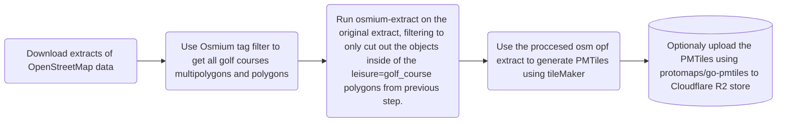

# Background
I got intrested in OpenStreetMap just becuase I was in the lookout for tools to create course guides for my local Golf Club. I found the project that is OpenStreetMap during the summer of 2024. I also found that previous work have been done in documenting a tagging schema for golf features in OpenStreetMap during the years: [OpenStreetMap wiki: Tag:leisure=golf_course](https://wiki.openstreetmap.org/wiki/Tag:leisure%3Dgolf_course)

I have though about generating vector tiles for showing of the modern capalities in golf-apps ever since. I have seen so many golf centric apps which just uses OpenStreetMap Carto, which is not optimal in 2026. Leveraging modern technology such as vector tiles is the way to go. After JW started building the tool [Fairwaymapper](https://www.fairwaymapper.com/map). [Thread on the OpenStreetMap Community Forum about FairwayMapper.](https://community.openstreetmap.org/t/fairwaymapper-introducing-golfers-to-mapping/142814) I starting with gathering feedback and trying to solve the biggest problems in documented tagging of golf course facilities on the OpenStreetMap wiki. The most crucial problem to solve would be how we would represent mutliple courses on facilites with 2+ courses. The best proposal we found was using a route=golf relations which would allow one to create vector tiles with data which could be used to animate each hole in one particular course, such as FairwayMappers 3D viewer does. Seeing that the project fairwaymapper went well I got inspired.

Many applications could then use these tiles in free and open source golf apps.

It will be intresting to document and estimate how much memory, compute and storage it will take to procces all the golf data in the osm database.

# Plan:
My plan is to devlop:

- Simple Vector schema for golf features on zoom 14+ 
- Process scripts for featurs wich can be found inside of a (multi)polygons that is leisure=golf_course.
- A Maplibre GL Style for maplibre GL JS. 
- A collection of tools and instructions how to generate your own golf centric golf tiles. 
- (Maybe depending on the cost) host the PMtiles on a Cloudflare R2 S3 bucket through the [golftiles.org](https://golftiles.org/) domain. 

My initial plan is to produce PMtiles to avoid having to run a tile server to reduce cost for the inital step. When a style and almost complete vector schema is in place, we can then move on to create a dynamic tile server to serve atleast daily updated tiles to encourage mappers.

# Previous discussion and questions on forums:
- Question about to be able to fallback to general purpose tileset for orientation to the golf courses on OSM US Slack: https://osmus.slack.com/archives/C03TFH5NE83/p1779814786461319 Using one for basemap and our golfTiles for overlay.
- Good feedback from the #developer channel in the OpenStreetMap Discord on how to make the export and filtering: [link](https://discord.com/channels/413070382636072960/607265062322700308/1508868644770283601)
- Tips from utidjinn, having a similair goal on the [OSM US slack #golf channel](https://osmus.slack.com/archives/CU8J8335X/p1780070298248989?thread_ts=1779912821.021149&cid=CU8J8335X)


---
title: Plan for generating the PMtiles:
---


## Development:
I created a tag filter with the ways and relations with the leisure=golf_course, using the geojson did not work in using it with the extract command, but my fast look at the geojsons it looks like it can detect it so that was a good sanity-check that the tag-filter was succesfull when opening it in QGIS. So I did not use the export to geojson, but just used the two files. I was able to generate some PMtiles using the default OpenMapTiles schema which is included in the tileMaker repository. I then used the extract command with the tag filtered pbf file which was 618 kb. I first used the smart strategy, but that looks like it includes way to much data outside of the facilities. I then switched back to the complete_ways strategy and on the complete sweden export it took: 
```[ 0:09] Peak memory used: 4713 MBytes``` when running the Osmium-tool inside of WSL 2 on a Ubuntu 26.04 OS. The resulting file pbf was: ```6 279kb``` for Sweden. See the shell scripts in the repo.

- [X] Wrote the .json for configuring the layers for tileMaker. My initial though is to put all golf features into one layer with no cut-offs for zoom. When viewing a golf course you are viewing the course at zoom level 14+ anyways.


# How to run

Install [Osmium-tool](https://osmcode.org/osmium-tool/). Build tilemaker from [source](https://github.com/systemed/tilemaker/tree/master). Download a planet [extract .pbf file](https://switch2osm.org/serving-tiles/#System-requirements). Then run 
1. ```osmium tags-filter``` as seen in [osmium-tool/osmiumtagfilter1.sh](osmium-tool/osmiumtagfilter1.sh). 
2. ```osmium extract``` as seen in [osmium-tool/osmiumextract2.sh](osmium-tool/osmiumextract2.sh)
3. then run tilemaker as seen in [tilemaker/tilemaker.sh](tilemaker/tilemaker.sh) with the [tilemaker/config.json](tilemaker/config.json) and [tilemaker/process.lua](tilemaker/process.lua) as parameters. Optionally add the store location to allow tilemaker to use ssd as swap space instead of running all in RAM. 
4. You should now have your PMtiles file which you can server with any web server which support [HTTP Range Requests](https://developer.mozilla.org/en-US/docs/Web/HTTP/Guides/Range_requests). More information in the Protomaps Docs regarding [Cloud Storage for PMtiles](https://docs.protomaps.com/pmtiles/cloud-storage).


# Next steps:
- [ ] Write the basics of ```procces.lua``` for tileMaker. Trying to gather as much features as I can think of. This can then be used when we adapt the code in the future for a dynamic tile server.
- [ ] Figure out how to encode the two different tagging practices of tagging course(s) in a facility into the tiles. Using the ```route=golf```
- [ ] Try to generate some samples.
- [ ] Optimize the generation, sort the id´s with ```osmium renumber``` and tilemakers ```--compact```
- [ ] Put up finished PMtiles on [golftiles.org](https://golftiles.org/)
- [ ] Document the tile schema like [shortbread-docs](https://github.com/shortbread-tiles/shortbread-docs) does, using Hugo to github pages!
- [ ] Gather icons and typeface for the style.
- [ ] Write the style.
- [ ] Make a vector logo for the project.
- [ ] Generate the whole world, maybe split up it into files and combine it all using osmium for the continents manually downloaded. 
- [ ] If the size of the tiles is to large for my small web host, move the domain to Cloudflare and setup a Cloudflare R2 bucket for the tiles. All free when the amount of requests is <10 Million each month.
- [ ] Make a demo on [golftiles.org](https://golftiles.org/) showing of the PMtiles and style rendered using [MapLibre GL JS](https://maplibre.org/maplibre-gl-js/docs/). Combinining it with some other general vector tiles for location purposes in a mapblire layer below. Possible could be: [openfreemap.org](https://openfreemap.org/) 
- [ ] Add [Mapterhorn](https://mapterhorn.com/) pmtiles as DEM data to the demo viewer.
- [ ] Add tilemaker as a git submodule to this project.
- [ ] Create github actions, generating and publishing tiles to github pages if tiles <10 GB.
- [ ] (Maybe) package the solution to a docker container with all dependencies for the tools.


# Future technical development to solve the limitation using tileMaker
In the future one could maybe use a "dynamic" tile generator server such as:
- osm2psql 
- imposm3 
- Martin. 
To be able to do incremental updates, but this would be more complext and require server infrastructure. Thats where grants comes into the picture.

- Other future endeavours could also be to explore the new [MapLibre Tile (MLT)](https://github.com/maplibre/maplibre-tile-spec) to encode the DEM data from [Mapterhorn](https://mapterhorn.com/) directly into the tiles. 

## Grants and funding
I registred the domain https://golftiles.org to be able to serve the tiles through the Cloudflare R2 bucket under that domain for the initial PMtiles offering. When we then have something concrete to show grant organisations that this would be something good for the golf community as a whole, we could ask for some money for compute and serve the tiles publicaly.

I will try to contact the following when I have a 1.0 release of some PMTiles and a style to show off:
- [Allmänna arvsfonden](https://www.arvsfonden.se/). 
- American Golf Industry Coalitions [GRASSROOTS GRANTS PROGRAM](https://www.golfcoalition.org/grassrootsgrants).
- [Lnu Innovation](https://lnu.se/mot-linneuniversitetet/samarbeta-med-oss/lnu-innovation/)


More suggestions welcome!


# Help wanted!
I would need help in any of the following areas: 
- [ ] Writing more on the process.lua to pick out what features could occur inside of a golf course facility.,
- [ ] Writing a Maplibre GL style for the tiles.
- [ ] Writing a basic course viewer using some web framework togheter with Maplibre GL JS. Especially intresting would be to consume the route=golf course data in the tiles to be able to chose as particular course and animate through it when the facility have more than one course.
- [ ] Import golf features into PostGIS database,
- [ ] Generate features on the fly using this PostGIS database. 
- [ ] Serving tiles using this tileserver.
- or if you have something else you want to help out with, just drop an issue or submit a pull request.

You can start and look at the [tilemaker/process.lua](tilemaker/process.lua) for what keys and improve it by adding more keys and logic you can find inside of a [Tag:leisure=golf_course](https://wiki.openstreetmap.org/wiki/Tag:leisure%3Dgolf_course)

# Attribution:
Using this code and style should be attributed to golfTiles. Tiles generated by the schema is attributed to "[golftiles.org](https://golftiles.org/). OpenStreetMap contributors". and link to openstreetmap.org/copyright and this repository. If you are using Maplibre Gl JS, it can fetch the attribution from the tiles themselves as defined in [tilemaker/config.json](tilemaker/config.json)


# License:
The Vector tile schema, cartography decisions, lua rules and style is licensed under [GPL-3.0 license](LICENSE). Note that the GPL alows you to use it on your own server(SaaS or ASP loophole) and then generate tiles to use in your commercial application. Note that the ODbL still apply for OpenStreetMap data, always give the proper attribution where you display the tiles.